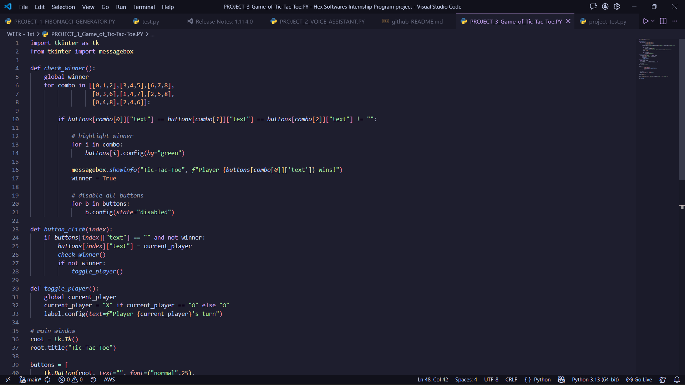
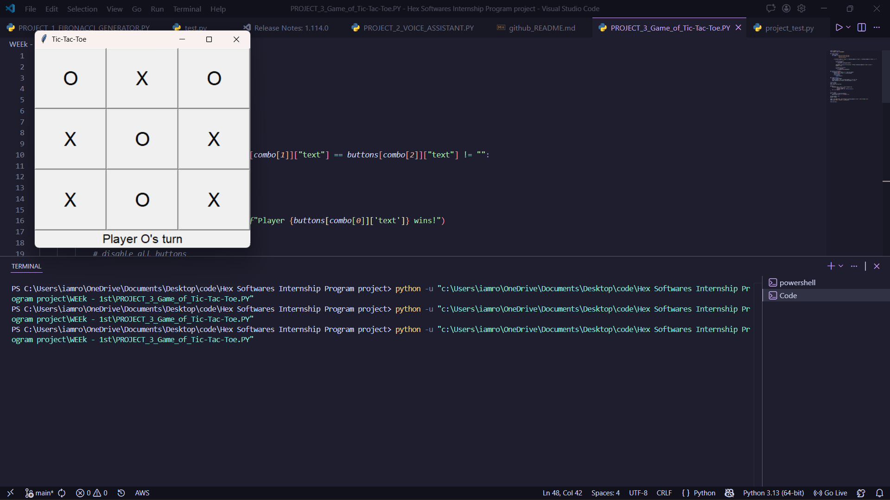
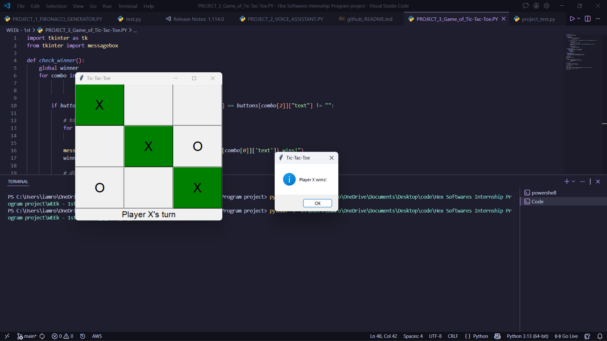

# 🎮 Tic Tac Toe Game (Python)


---

## 📌 Project Title

**Tic Tac Toe Game in Python – Hex Software Internship (Project 3)**

---

## 📖 Description

This project is a simple and interactive **Tic Tac Toe game** developed using Python as part of my internship at **Hex Software**.

The game allows two players to compete against each other in a classic 3x3 grid. It demonstrates core programming concepts such as:

* Conditional statements
* Loops
* Functions
* User input handling
* Game logic implementation

---

## 🚀 Features

* 🧑‍🤝‍🧑 Two-player mode (Player X vs Player O)
* 🎯 Input validation
* 🏆 Winner detection system
* 🔁 Replay option
* 💻 Simple CLI-based interface

---

## 🛠️ Technologies Used

* **Python 3**

---

## 📂 Project Structure

```
Tic-Tac-Toe-Python/
│
├── tic_tac_toe.py      # Main game file
├── README.md           # Project documentation
```

---

## ▶️ How to Run

1. Clone the repository:

```bash
git clone https://github.com/Ronit049/tic-tac-toe-python.git
```

2. Navigate to the project folder:

```bash
cd tic-tac-toe-python
```

3. Run the game:

```bash
python tic_tac_toe.py
```

---

## 🎮 Game Rules

* The game is played on a 3x3 grid.
* Player 1 uses **X** and Player 2 uses **O**.
* Players take turns marking a cell.
* The first player to align 3 marks (row, column, or diagonal) wins.
* If all cells are filled without a winner, the game ends in a draw.

---

## 📸 Screenshot


```



```

---

## 📌 Learning Outcomes

Through this project, I learned:

* Structuring Python programs
* Implementing game logic
* Handling edge cases in user input
* Writing clean and readable code

---

## 🤝 Contributing

Contributions are welcome! Feel free to fork this repository and submit a pull request.

---

## 📜 License

This project is licensed under the **MIT License**.

---

## 👨‍💻 Author

**Ronit Raj**
💼 Aspiring Software Developer | Python Enthusiast

---

## 🔗 Connect with Me

* GitHub: https://github.com/Ronit049
* LinkedIn: https://linkedin.com/in/ronit-raj7497

---

⭐ If you like this project, don't forget to give it a star!
